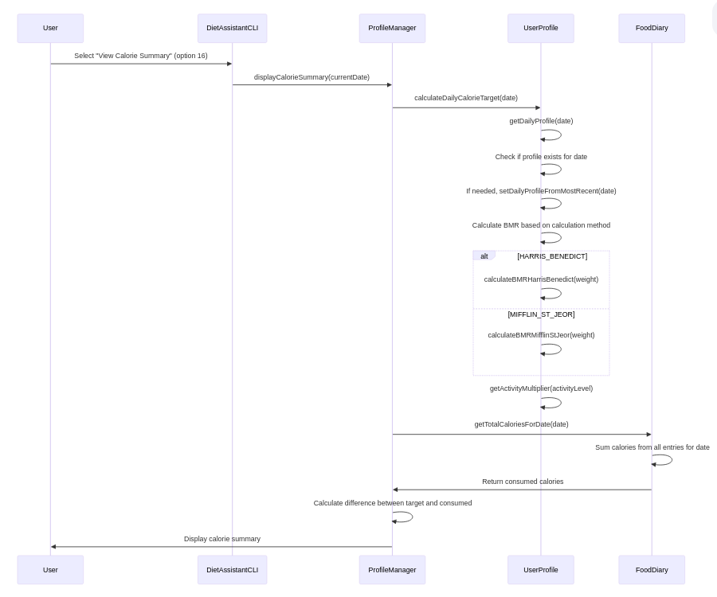

# DASS Assignment 3

## Diet Manager

### 06-04-2025

### TEAM:

- Atharva Kulkarni (2023101072)
- Kushal Balabhadruni (2023101039)

## Overview

The Diet Assistant is a command-line tool designed to help users manage their dietary habits efficiently. It combines a comprehensive food database, detailed daily logs, and personalized diet goal profiles to offer a complete nutrition tracking solution.

### Key Features:

#### Food Database:

- Basic Foods: Stores essential details for each food, including an identifying string, searchable keywords, and calories per serving.

- Composite Foods: Allows users to create new foods by combining existing basic or composite foods, with the total calorie count automatically computed from the components.

- Extensible Design: The database can be easily expanded to include additional nutritional information or integrate data from various web sources.

#### Daily Logs:

- Food Entry Management: Users can add, delete, and modify food entries, ensuring accurate tracking of daily consumption.

- Flexible Date Handling: Logs can be viewed and updated for any specific date, not just the current day.

- Undo Functionality: Supports an unlimited undo history during a session, allowing users to correct mistakes effortlessly.

#### Diet Goal Profile:

- Personalized Data: Tracks user details like gender, height, age, weight, and activity level.

- Calorie Intake Calculation: Computes daily target calorie intake using multiple methods, giving users the flexibility to choose the calculation that best suits their needs.

- Real-Time Feedback: Provides a summary of consumed calories versus the target, highlighting surpluses or deficits to help manage daily dietary goals.

This tool empowers users with clear insights into their nutrition, making it easier to stay on track with their diet and achieve their health objectives.

## UML Class Diagram

## Sequence Diagrams

### 1. Adding Food Entry

### 2. Viewing Calorie Summary

### 3. Creating a Composite Food

### 4. Undoing Last Action

### 5. Application Initialization

---

### Low Coupling

The design shows efforts to maintain low coupling through:

1. _Command Pattern Implementation_: The abstract Command class and its concrete implementations (AddFoodCommand and DeleteFoodCommand) allow the FoodDiary to execute commands without knowing their specific implementations, reducing dependency.

2. _Manager Classes as Intermediaries_: ProfileManager and FoodDatabaseManager act as intermediaries between the system components, preventing direct dependencies between classes like DietAssistantCLI and UserProfile or FoodEntry.

3. _Clear Responsibility Boundaries_: Each class has well-defined responsibilities, with dependencies flowing in a controlled manner (e.g., FoodDiary uses but doesn't directly modify FoodDatabaseManager).

### High Cohesion

High cohesion is evident in:

1. _Specialized Classes_: Each class has a clear, focused purpose - UserProfile manages user data, FoodDatabaseManager handles food storage, and ProfileManager manages profile operations.

2. _Related Functionality Grouping_: Methods within classes serve related purposes (e.g., UserProfile contains methods specifically about user profile attributes and calculations).

3. _Well-Defined Class Responsibilities_: FoodEntry specifically represents food items with their properties, while DailyProfile focuses on daily activity and weight tracking.

### Separation of Concerns

The design separates concerns effectively:

1. _UI/Logic Separation_: DietAssistantCLI handles user interaction separately from business logic in managers and entity classes.

2. _Data/Behavior Separation_: Entity classes (Food, FoodEntry, UserProfile) focus on data while manager classes (ProfileManager, FoodDatabaseManager) handle operations on that data.

3. _Command Encapsulation_: The Command pattern encapsulates specific operations (add/delete food) separately from the invoker (FoodDiary).

### Information Hiding

Information hiding principles are implemented through:

1. _Encapsulated Class Structure_: Classes expose specific methods without revealing implementation details (e.g., ProfileManager exposes profile operations without exposing how profiles are stored).

2. _Protected Class Relationships_: The design uses composition and inheritance strategically (e.g., Food as an abstract class with BaseFood and CompositeFood specializations).

3. _Focused Data Access_: Classes like FoodDiary use specific methods to access data rather than manipulating internal structures directly.

### Law of Demeter

Adherence to the Law of Demeter (principle of least knowledge) is shown by:

1. _Controlled Method Access_: Classes interact primarily with their immediate collaborators (e.g., DietAssistantCLI interacts with ProfileManager, not directly with UserProfile).

2. _Method Chaining Prevention_: The design prevents excessive method chaining by having classes interact primarily with their immediate neighbors.

3. _Delegation_: Manager classes delegate operations to appropriate specialized classes rather than exposing their internal components.

### Design Patterns

Several design patterns enhance the architecture:

1. _Command Pattern_: Used for food operations, allowing for extendable command set and operation encapsulation.

2. _Composite Pattern_: Implemented with Food, BaseFood, and CompositeFood, allowing foods to be treated uniformly whether they're simple or compound.

3. _Manager Pattern_: ProfileManager and FoodDatabaseManager centralize related operations.

4. _Façade Pattern_: DietAssistantCLI acts as a simplified interface to the complex subsystem.

### Overall Balance

The design achieves balance among competing criteria by:

1. _Strategic Tradeoffs_: Accepting some coupling (like FoodDiary to FoodDatabaseManager) to achieve higher cohesion and clearer separation of concerns.

2. _Hierarchical Organization_: Using inheritance and composition relationships judiciously to promote both flexibility and structure.

3. _Clear Communication Paths_: Defining clear paths for class interactions that maintain information hiding while allowing necessary functionality.

4. _Interface-Based Design_: Using abstract classes and well-defined interfaces to allow for implementation variations while maintaining a consistent structure.

---

## Strong Aspects:

1. Clear Separation of Responsibilities:

- The design distinctly separates data handling (FoodDatabaseManager, ProfileManager) from business logic (FoodDiary, UserProfile) and user interaction via DietAssistantCLI. This adherence to the Single Responsibility Principle makes the system more modular and maintainable.

2. Effective Use of Abstraction and Composition:

- Abstract classes like Food and Command ensure that shared behavior is defined at a high level, while concrete implementations provide specific functionality. Notably, the existence of AddFoodCommand and DeleteFoodCommand as subclasses of Command makes it very easy to implement and modularize undo functionality. Additionally, the composition relationships (e.g., CompositeFood containing FoodComponent, FoodDiary containing FoodEntry) clearly express part-whole hierarchies, promoting code reuse and clarity in representing complex food structures.

## Weak Aspects:

1. Potential Over-Coupling in CLI Interactions:

- The DietAssistantCLI currently directly interacts with multiple managers (ProfileManager, FoodDatabaseManager, and FoodDiary). Moreover, the ProfileManager and FoodDiary depend on FoodDatabaseManager for certain functionalities, leading to tight coupling between the user interface and backend logic. This tight coupling could complicate future enhancements or changes. Introducing a decoupled mediator pattern could effectively isolate UI concerns from business logic, enhancing flexibility and reducing the risk of errors during refactoring.

2. Unordered Food Logs and Unclear Command Handling:

- Although AddFoodCommand and DeleteFoodCommand are implemented, food entries are stored as an unordered list, with no tracking of the order in which items were added. This limits features like time-based analysis. Additionally, undo functionality and error handling are not clearly defined, which may lead to inconsistencies. Clarifying these aspects would improve system reliability.

## Key Design Points

### 1.Expanding for Additional Nutritional Information

- Extending the Food base class: Add virtual methods for each nutrient type (protein, carbs, etc.)
- Modifying BasicFood: Add fields for each nutrient and implement the virtual methods
- Extending CompositeFood calculations: Sum the nutrient values from components (similar to how calories are handled)
- Updating JSON serialization: Add new nutrient fields to toJson() and fromJson() methods
- The existing composite pattern means complex foods would automatically calculate total nutrients from components.

### 2. Integrating Multiple Food Data Sources

- Data Source Adapters: Create adapter classes for each external API (McDonald's, USDA, etc.)
- Common Interface: Define a standard interface these adapters must implement
- Factory Pattern: Use a factory to instantiate the appropriate adapter
- This approach isolates external data format details from your core system. Each adapter would convert source-specific data to your internal Food representation without affecting other parts of the code.

### 3. Adding New Calorie Calculation Methods

- The system uses an enum for calculation methods:

enum class CalorieCalculationMethod {
HARRIS_BENEDICT,
MIFFLIN_ST_JEOR
};

### 4. Adding New Food Information Sources

- As mentioned in point #2, implement:

- An adapter interface for external data sources
- Concrete adapters for each source
- A registration mechanism for new sources
- This isolates format-specific parsing code and allows adding new sources without changing core functionality.

### 5. Handling Large Log Files Efficiently

The design already implements several memory optimization techniques:

- Shared pointers: Foods are stored once in memory and referenced multiple times
- Component pattern: Composite foods reference existing food components
- String references: Food entries store food names rather than duplicating the food objects
- Lazy loading: The database is loaded only when needed
